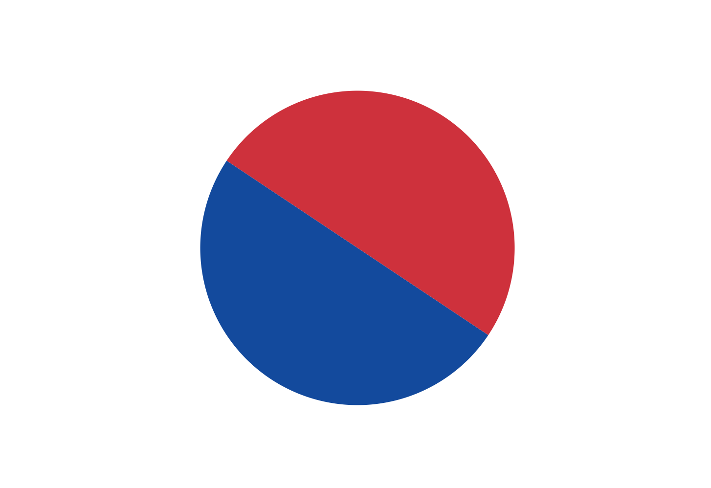

# 🇰🇷


- 2024년 광복절 기념 `CustomPaint`를 활용한 🇰🇷 그리기
- [국기 제작 도면](https://www.guri.go.kr/www/contents.do?key=461) 참고
  <div></div>

## 깃면 그리기

- 태극기 깃면의 가로:세로 비율은 3:2
- `AspectRatio`로 3:2 비율을 고정시킨다.
- `DecoratedBox`를 사용해서 border를 그려준다.
- `AspectRatio.child`에 `LayoutBuilder`를 사용해서 `CustomPaint`에 size를 전달한다. `CustomPaint`는 이 수치를 사용해서 태극 문양과 괘의 layout을 계산한다.


## 태극 문양 그리기

태극 문양은 두 단계에 걸쳐 그릴 수 있다.

1. 빨간색과 파란색 반으로 나뉜 원을 그린다.
2. 반지름을 지름으로 하는 빨간색, 파란색 원을 왼쪽, 오른쪽에 덮어서 그린다.

빨간색과 파란색 반원은 태극기의 왼쪽 위 모서리와 오른쪽 아래 모서리로 그어지는 대각선으로 나뉜다. 따라서, `drawArc`로 반원을 그릴 때 시작 각도(`startAngle`)는 0과 pi radian에서 이 대각선의 내각을 더한 위치가 되어야 한다. 대각선으로 나뉘는 직각 삼각형의 밑변과 높이를 알고 있으므로, 사잇각을 구하기 위해 `atan()`을 사용한다.

```dart
class TaegukgiPainter extends CustomPainter {
  @override
  void paint(Canvas canvas, Size size) {
    final angle = atan(size.height / size.width);
    ...
    canvas.drawArc(rect, angle, pi, false, bluePaint);
    canvas.drawArc(rect, pi + angle, pi, false, redPaint);
  }
}
```



다음으로, 대각선을 축으로 하고 그려진 원의 반지름을 지름으로 하는 빨간색, 파란색 반원을 그려준다. 각 원의 색상이 기존 색상을 덮어쓰면서 태극 모양으로 보이게 된다.


## 괘 그리기

괘는 태극기를 가로지르는 대각선에 수직 방향으로 그려진다. 위에서 계산한 대각선 사잇각과 직각 삼각형의 성질을 이용해서 아래와 같이 괘의 중심점과 양 끝점을 계산할 수 있다.


괘의 각 line의 center 좌표를 계산한 뒤, center에서 좌우로 떨어져 있는 두 point를 계산하여 `drawLine`으로 괘를 그려준다. 괘의 line 길이, 두께, line 간격 등을 모두 알고 있으므로 `for`문을 이용해서 3줄의 line을 같은 방법으로 그려준다. 아래는 곤괘를 그리는 예시이다.


자세한 코드는 [여기](./lib/taegukgi/taegukgi_painter.dart)서 확인할 수 있다.
